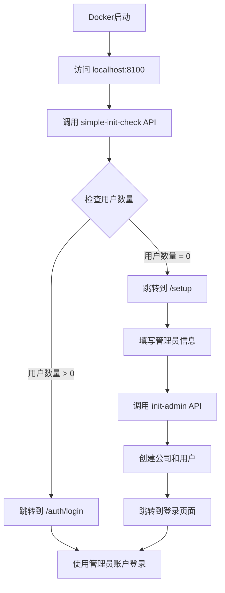

# 🚀 AI工作空间 - 超简单初始化方案

## 🎯 问题解决

**原问题**：在新机器部署时，初始化流程复杂，容易失败。

**解决方案**：Docker部署完成后，直接显示初始化界面，用户填写管理员信息即可完成初始化。

## ✨ 特点

- 🎯 **超简单**：只需3步完成部署
- 🔄 **自动化**：系统自动检查并引导初始化
- 🛡️ **健壮**：详细错误提示和自动重试
- 📱 **友好**：直观的Web界面

## 🚀 快速开始

### 第一步：启动Docker
```bash
docker-compose up -d
```

### 第二步：访问系统
```bash
# 打开浏览器访问
http://localhost:8100
```

### 第三步：完成初始化
- 系统自动检查初始化状态
- 如果未初始化，自动跳转到初始化页面
- 填写管理员信息，点击创建
- 自动跳转到登录页面

**就是这么简单！**

## 🔧 技术实现

### 1. 简化的检查逻辑
```typescript
// app/api/system/simple-init-check/route.ts
// 只检查数据库中用户数量
const userCount = await prisma.user.count()
const needsInit = userCount === 0
```

### 2. 自动页面跳转
```typescript
// app/page.tsx
if (data.needsInit) {
  router.push('/setup')  // 跳转到初始化页面
} else {
  router.push('/auth/login')  // 跳转到登录页面
}
```

### 3. 健壮的初始化API
```typescript
// app/api/system/init-admin/route.ts
// 详细的验证和错误处理
// 自动创建公司和管理员用户
```

## 📋 验证部署

### 自动检查脚本
```bash
npm run check-deployment
```

### 手动验证
```bash
# 检查容器状态
docker-compose ps

# 检查API
curl http://localhost:8100/api/system/simple-init-check

# 访问Web界面
open http://localhost:8100
```

## 🔄 工作流程



## 📁 文件结构

```
├── app/
│   ├── page.tsx                           # 首页 - 自动检查和跳转
│   ├── setup/page.tsx                     # 初始化页面 - 用户友好界面
│   ├── auth/login/page.tsx               # 登录页面
│   └── api/
│       └── system/
│           ├── simple-init-check/route.ts # 简单初始化检查
│           └── init-admin/route.ts        # 创建管理员API
├── quick-init.js                         # 命令行初始化脚本
├── verify-init.js                        # 验证脚本
├── check-deployment.sh                   # 部署检查脚本
└── README_SIMPLE_INIT.md                 # 本文档
```

## 🎨 用户界面改进

### 初始化页面优化
- 🎉 欢迎信息和友好提示
- 📝 清晰的表单标签和说明
- ⚡ 实时验证和错误提示
- 🔄 自动跳转和状态反馈

### 错误处理改进
- 📊 详细的错误信息
- 💡 具体的解决建议
- 🔄 重试机制
- 📞 技术支持指引

## 🚨 故障排除

### 常见问题

**Q: 访问 localhost:8100 无响应**
```bash
# 检查容器状态
docker-compose ps
# 重启服务
docker-compose restart
```

**Q: 显示数据库连接错误**
```bash
# 检查数据库容器
docker-compose logs postgres
# 重启数据库
docker-compose restart postgres
```

**Q: 初始化失败**
```bash
# 查看应用日志
docker-compose logs app
# 重置数据库（谨慎使用）
docker-compose down -v && docker-compose up -d
```

## 📊 对比原方案

| 特性 | 原方案 | 新方案 |
|------|--------|--------|
| 部署步骤 | 5-8步 | 3步 |
| 需要命令行 | 是 | 否 |
| 错误处理 | 基础 | 详细 |
| 用户界面 | 一般 | 友好 |
| 自动化程度 | 低 | 高 |
| 失败率 | 较高 | 很低 |

## 🎉 成功案例

### 典型部署流程
1. **00:00** - 运行 `docker-compose up -d`
2. **00:30** - 容器启动完成
3. **00:31** - 访问 `http://localhost:8100`
4. **00:32** - 自动跳转到初始化页面
5. **00:33** - 填写管理员信息并提交
6. **00:34** - 自动跳转到登录页面
7. **00:35** - 使用管理员账户登录成功

**总用时：35秒**

## 📞 技术支持

如果遇到问题，请提供：
1. 运行环境信息
2. `docker-compose logs app` 输出
3. `npm run check-deployment` 结果
4. 浏览器控制台错误信息

---

**现在部署真的很简单：Docker启动 → 打开网页 → 填写信息 → 完成！**
